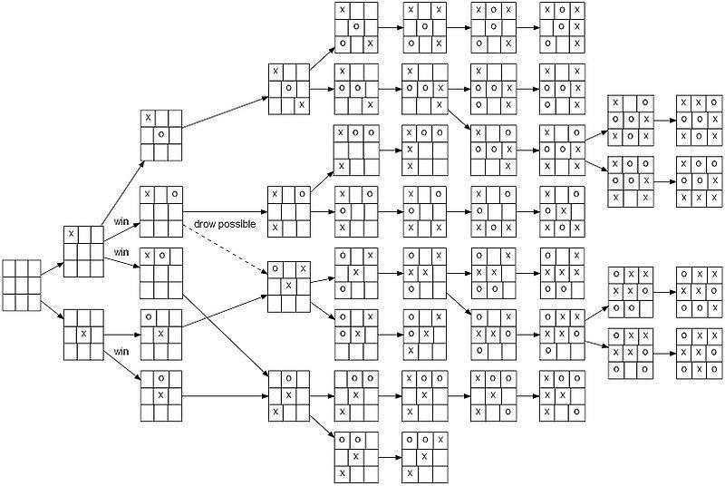

# Using minimax algorithm to "solve" tic-tac-toe!

As it turns out, two reasonably skilled players should always draw in a game of tic-tac-toe. However, don't let your guard slip against this bot (when it's on hard mode). See the pdf for a quick visual explanation; or, read this if you have time to kill :)

## Generating game states

The minimax algorithm involves traversing a tree which carries many possible game states, where each node represents a singular state. A node's child represents a possible move/decision which could take place, altering the parent state slightly (example: it's your turn but you're still pondering what move to make. That state of the tic-tac-toe grid can be the parent. Once you place your "X" on a spot, voila, you've made the child! So, there are as many children for a given node as there are possible moves). 

   

## Designing a heuristic

You can imaging computing all game states like a person with immense forsight, where they are able to see [in the case of tic-tac-toe] 9 moves in advance. Now, given we generate this large tree of game states in advance, how do we determine which immediate move is the best? This involves creating some kind of scoring system, or heuristic, to judge them. However, we must factor in the fact that whoever utilizes the minimax algorithm wants to score their wins with high values and their losses low (and presumably, drawing as 0). To make this symmetric, we assign negative values for states where the minimizing player wins and positive values for when the maximizing player wins. We will grade winning game states as such:

        "max" player victory: 1 * (# of open squares prior to token placement)
                
        "min" player victory: -1 * (# of open squares prior to token placement)

This scoring system will prioritize winning as soon as possible (and assumes that the opponent/minimizing player will do the same). Now that the computer has a way to discern good game states from bad, we must implement the algorithm which traverses the game tree and selects the best path.

## How to Maximize/Minimize

See the pdf's visuals (in the repo)
